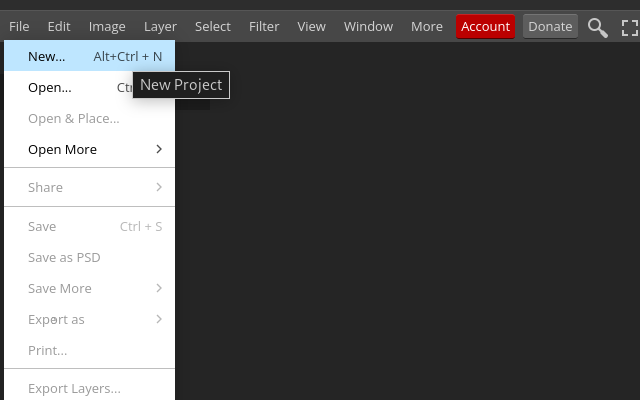
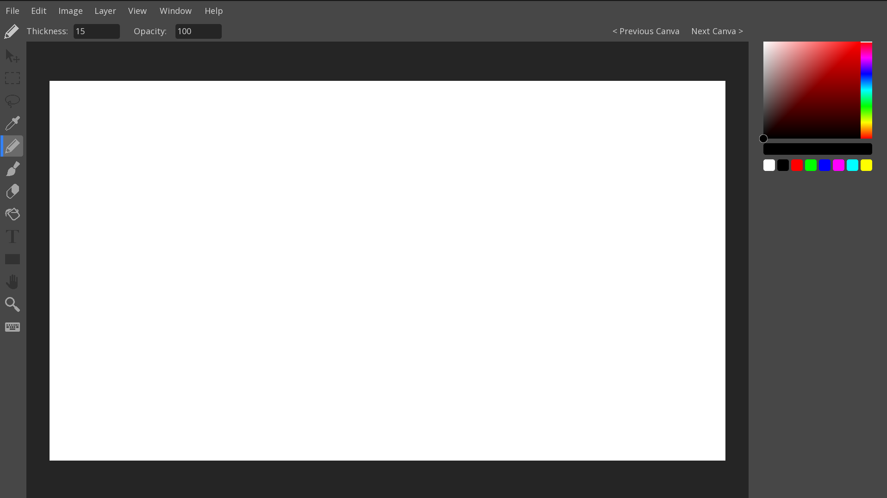
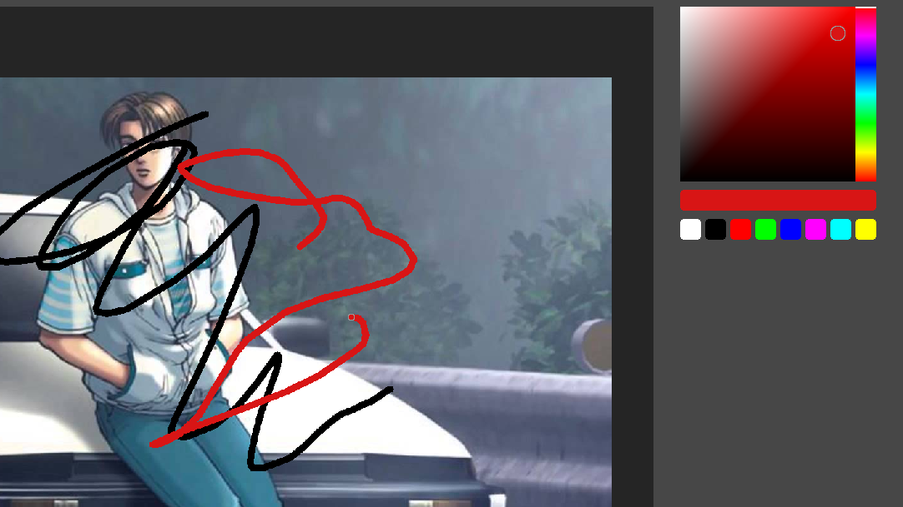
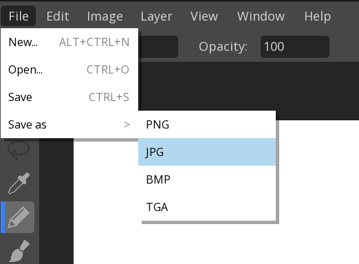

# 🎨 MyPaint - Digital Painting Application

A digital painting application built with C and CSFML as part of the B-MUL-200 multimedia programming course at Epitech. This project demonstrates fundamental graphics programming concepts, user interface design, and drawing tool implementation.

## 📋 Project Overview

MyPaint is a student project that recreates the basic functionality of a digital painting application. Built using C programming language and the CSFML (Simple and Fast Multimedia Library), it showcases skills in graphics programming, event handling, and software architecture.

This first-year project implements core features like drawing tools, canvas management, and a graphical user interface, serving as an introduction to multimedia programming and game development concepts.

## ✨ Features

### 🖌️ Drawing Tools
- **Pencil Tool**: Basic line drawing with adjustable thickness
- **Brush Tool**: Brush strokes with opacity control
- **Eraser Tool**: Erase pixels with adjustable size
- **Bucket Fill**: Fill enclosed areas with color
- **Color Picker**: Sample colors from the canvas

### 🎨 Canvas Management
- **Canvas Support**: Work with drawing canvases
- **Zoom & Pan**: Basic zooming and canvas navigation
- **Canvas Positioning**: Move and scale the canvas
- **Transparent Background**: Transparency grid display
- **Canvas Creation**: Create new canvases with different sizes

### 🎛️ User Interface
- **Dark Theme**: Simple dark interface
- **Toolbar**: Tool selection panel
- **Color Picker Widget**: RGB color selection
- **Layer Panel**: Basic layer management
- **Tool Options**: Thickness and opacity controls

### 💾 File Operations
- **Image Formats**: Support for PNG, JPG, BMP, TGA formats
- **Load Images**: Open existing images for editing
- **Save Options**: Export artwork in various formats

### ⌨️ Controls
- `Alt + Scroll`: Zoom in/out
- `Ctrl + Scroll`: Move canvas horizontally
- `+/-`: Adjust tool thickness

## 🖼️ Gallery


<div align="center">
  
  
</div>

<div align="center">
  
  
</div>

## 🚀 Installation

### Prerequisites

Before building MyPaint, ensure you have the following dependencies installed:

**Ubuntu/Debian:**
```bash
sudo apt-get update
sudo apt-get install build-essential gcc libcsfml-dev libsfml-dev
```

**Fedora/CentOS:**
```bash
sudo dnf install gcc make CSFML-devel SFML-devel
```

**Arch Linux:**
```bash
sudo pacman -S gcc make csfml sfml
```

### Building from Source

1. **Clone the repository:**
   ```bash
   git clone https://github.com/your-username/paint.git
   cd paint
   ```

2. **Build the application:**
   ```bash
   make
   ```

3. **Run MyPaint:**
   ```bash
   ./my_paint
   ```

## 🎯 Usage

### Getting Started

1. **Launch the application:**
   ```bash
   ./my_paint
   ```

2. **Create a new canvas:**
   - Use the File menu to create a new project
   - Choose from preset canvas sizes or create custom dimensions
   - Select your preferred background color

3. **Select drawing tools:**
   - Click on tools in the left toolbar
   - Adjust thickness and opacity in the tool options panel
   - Use the color picker to choose your colors

4. **Save your work:**
   - Use File > Save As to export in various formats
   - Choose from PNG, JPG, BMP, or TGA formats

### Key Features

- **Canvas Navigation**: Use Alt+Scroll for zooming, Ctrl+Scroll for panning
- **Tool Settings**: Adjust brush thickness and opacity
- **Color Selection**: Use the color picker to choose drawing colors
- **Basic Layer Support**: Simple layer management functionality

## 🔧 Build Instructions

### Standard Build

To compile the project:
```bash
make
```

### Clean and Rebuild

To clean object files and rebuild:
```bash
make clean
make
```

### Running Tests

To run the test suite:
```bash
make tests_run
```

### Code Style Check

To check coding style (Epitech norm):
```bash
make style
```

## 📦 Dependencies

### Core Libraries
- **CSFML**: Simple and Fast Multimedia Library for C
  - `libcsfml-system`
  - `libcsfml-window`
  - `libcsfml-graphics`
  - `libcsfml-network`
  - `libcsfml-audio`

### System Dependencies
- **GCC**: GNU Compiler Collection
- **Make**: Build automation tool
- **Math Library**: `libm` for mathematical operations

### Development Dependencies
- **Criterion**: Unit testing framework (for testing)
- **gcovr**: Code coverage reporting (for testing)

### Asset Requirements
- OpenSans font (`assets/opensans.ttf`)
- Tool icons and UI assets (PNG format)
- Transparency grid texture

## 📄 License

This project is licensed under the MIT License - see the [LICENSE.md](LICENSE.md) file for details.

```
MIT License

Copyright (c) 2024 TekyoDrift

Permission is hereby granted, free of charge, to any person obtaining a copy
of this software and associated documentation files (the "Software"), to deal
in the Software without restriction, including without limitation the rights
to use, copy, modify, merge, publish, distribute, sublicense, and/or sell
copies of the Software, and to permit persons to whom the Software is
furnished to do so, subject to the following conditions:

The above copyright notice and this permission notice shall be included in all
copies or substantial portions of the Software.
```

## 🤝 Contributing

This is a student project, but contributions and improvements are welcome! 

### How to Contribute

1. **Fork the repository**
2. **Create a feature branch** (`git checkout -b feature/new-feature`)
3. **Commit your changes** (`git commit -m 'Add new feature'`)
4. **Push to the branch** (`git push origin feature/new-feature`)
5. **Open a Pull Request**

### Development Guidelines

- Follow the Epitech coding style (use `make style` to check)
- Comment your code appropriately
- Test new features before submitting

## 📧 Contact

**Project Maintainer:** Mallory Scotton  
**Email:** [mscotton.pro@gmail.com](mailto:mscotton.pro@gmail.com)

**Project Contributors:**
- Mallory Scotton - [mallory.scotton@epitech.eu](mailto:mallory.scotton@epitech.eu)
- Hugo Cathelain - [hugo.cathelain@epitech.eu](mailto:hugo.cathelain@epitech.eu)

**Project Information:**
- **Institution:** Epitech
- **Year:** 2024
- **Course:** B-MUL-200 (Multimedia Programming)

---

*Made with ❤️ and lots of learning* ✨

A first-year project exploring graphics programming, C language, and CSFML. This paint application demonstrates fundamental concepts in multimedia programming and user interface development.
